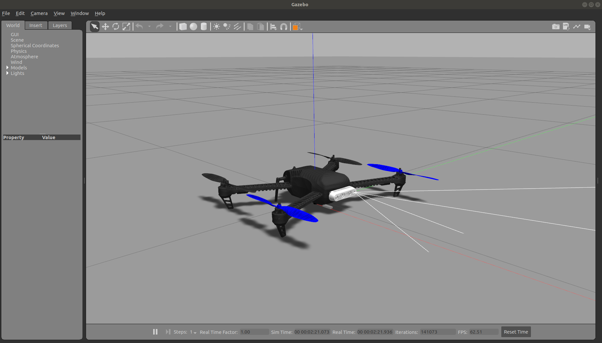

# Gazebo Model for the Uvify IFO-S with PX4 Software-in-the-Loop

 
Simulated quadcopter vs the real quadcopter, running the same code.

 


This repo is a collection of ROS packages, Gazebo models, Gazebo plugins, as well as the `PX4-Autopilot` source code contained as a git submodule. It does not contain the Gazebo simulator itself, or ROS. These are all dependencies that must be installed as per the instructions below.

Currently, this simulator is intended for Ubuntu 18.04 with ROS Melodic

This model uses the [Iris quadcopter model](https://github.com/PX4/PX4-SITL_gazebo/tree/d8366bf2389eae6106d1dbfaac72ebfdf23a5d2d/models/iris) available in the `PX4-SITL_gazebo` repo as a starting point, which is then modified to have the same sensor configuration as the Uvify IFO-S


## Folder structure

- `./docs/` : A directory for any files related to documentation.
- `./cpr_office_gazebo/` : A copy of the Clearpath Robotics' "Office World".
- `./ifo_description/` : Folder containing CAD meshes and URDF/Xacro files that describe the actual gazebo model
- `./ifo_gazebo/` : Gazebo-specific config files, launch files, and a ROS node that emulates a motion capture system VRPN server.
- `./PX4-Autopilot/` : A submodule containing the PX4 source code.
- `./realsense_gazebo_plugin/` : A submodule of a realsense plugin made by PAL Robotics.

## TODO
1. Add bottom-facing 1D Lidar and camera

## Pre-requisites

1. Gazebo + ROS Melodic (follow standard install instructions for the `desktop-full` option [here](http://wiki.ros.org/melodic/Installation/Ubuntu))
2. Python catkin tools (installable with `sudo apt-get install python3-catkin-tools`)

# Getting Started
This repo is a collection of ROS packages that contains everything you need to create a simulated version of the Uvify IFO-S quadcopter in Gazebo with ROS. 

The `PX4-Autopilot` repo, which contains the software of the Uvify IFO-S flight controller, is stored as submodule of this repo. This allows the PX4 directory to be fixed relative to the gazebo model, which simplifies the simulator start-up procedure since the user no longer needs to specify the location of PX4 source code. Moreover, this gives us control of the exact version of `PX4-Autopilot`, meaning this repo will not break if the PX4 developers push a new commit to the `PX-Autopilot` repo. The `PX4-Autopilot` repo has lots of submodules itself, so it is critical to clone this repo with the `--recursive` flag. Start by creating the folder `~/catkin_ws/src/`. Then

    cd ~/catkin_ws/src
    git clone git@github.com:decarsg/ifo_gazebo.git --recursive

Feel free to change the above URL to one appropriate for SSH-keys. Alternatively, you can clone this repo regularly and then run `git submodule update --init --recursive`. 

Next, we must blacklist the `PX4-Autopilot` directory in the catkin tools, so that the `catkin build` command does not compile the PX4 source code (since it fails). PX4 must be built manually. While inside your catkin workspac, add the `px4` package to the blacklist,

    catkin config --blacklist px4

You can now run 

    catkin build

and test to see that all the packages get built successfully, with the px4 package being skipped. 

>**Note:  We prefer `catkin build` instead of `catkin_make` to build a ROS workspace, but `catkin_make` should also be possible. Check out the [documentation for catkin](https://catkin-tools.readthedocs.io/en/latest/verbs/catkin_build.html).**

### Building the PX4-Autopilot Source Code
To compile PX4 manually, we must first install the toolchain. Thankfully PX4 provides an install script which installs everything required. The PX4 documentation cites that their installation scripts, are intended for a _clean_ Ubuntu 18.04 installation. It might still work for a non-fresh installation, but it is recommended to run `rm -rf ~/.ros` beforehand. 

    bash ~/catkin_ws/src/ifo_gazebo/PX4-Autopilot/Tools/setup/ubuntu.sh

Reboot your computer when complete. Technically, at this point, your computer is also outfitted with a development environment to modify the PX4 source code itself, and do some basic software-in-the-loop (SITL) testing in simulation.  Now, build the PX4 code. 

    cd ~/catkin_ws/src/ifo_gazebo/PX4-Autopilot
    make px4_sitl gazebo

This can take a long time, and can fail multiple times with a C++ compiler failure. The reason of failure is apparently due to your computer running out of RAM. Nevertheless, the build process gets a little further every time, so the solution is just to keep running `make px4_sitl gazebo` until it succeeds. Once successful, you should see the PX4 app start up in the terminal and the Gazebo GUI launching. You should only need to do this build step once, provided that you never modify the PX4 source code.

See PX4's [Ubuntu Development Environment instructions](https://docs.px4.io/master/en/dev_setup/dev_env_linux_ubuntu.html) for reference.

### Installing ROS, Gazebo, MAVROS
 Next, the PX4 documentation conveniently provides an install script which will install all the required software for ROS/Gazebo simulation including ROS Melodic, Gazebo 9, MAVROS and more

    cd ~
    wget https://raw.githubusercontent.com/PX4/Devguide/master/build_scripts/ubuntu_sim_ros_melodic.sh
    bash ubuntu_sim_ros_melodic.sh

See PX4's [ROS/Gazebo installation instructions](https://docs.px4.io/master/en/dev_setup/dev_env_linux_ubuntu.html#rosgazebo) for reference.

Note that this will create some additional folders under `~/catkin_ws/src/` such as `~/catkin_ws/src/mavros/`. If you have no need to modify the source code of these packages, feel free to delete these folders so they arn't compiled every time with `catkin build`. If you do this, install MAVROS dependencies with

    sudo apt-get install ros-melodic-mavros ros-melodic-mavros-extras

As per the official [MAVROS installation instructions](https://github.com/mavlink/mavros/tree/master/mavros#installation), we also need to install some geographic dataset dependency for proper reference frame conversions.

``` bash
cd ~
wget https://raw.githubusercontent.com/mavlink/mavros/master/mavros/scripts/install_geographiclib_datasets.sh
sudo bash ./install_geographiclib_datasets.sh
rm install_geographiclib_datasets.sh     # Delete the file once done.
```

### Launching the simulator
Finally, we need to source the usual setup script in `catkin_ws/devel/setup.bash`, but also a custom script `setup_ifo_gazebo.bash` located in this repo, which manually specifies the paths to relevant dependencies inside the PX4 source using environment variables. These two scripts need to be run for every new terminal. Alternatively, adding them to `~/.bashrc` will automatically execute them with every new terminal

``` 
echo "source ~/catkin_ws/devel/setup.bash" >> ~/.bashrc
echo "source ~/catkin_ws/src/ifo_gazebo/setup_ifo_gazebo.bash suppress" >> ~/.bashrc
```
Restart your terminal. Then, you should be ready to fire up the simulator

    roslaunch ifo_gazebo ifo_empty_world_1.launch

The PX4 app should be running in the terminal, and the Gazebo GUI should have started, displaying a single quadcopter located at the origin. You can run `rostopic list` and you should see a large list of topics. You can see it in action by typing

    commander takeoff
    
in the same terminal you used to type the previous command (the one with all the PX4 printout). Watch the quadcopter take off and immediately land. You can also open a second terminal and type `rostopic echo /mavros/local_position/pose` to view the state estimate in real time.

### Launching multiple drones

An example can be seen here, which will launch 3 drones.

``` 
roslaunch ifo_gazebo ifo_empty_world_3.launch
```

Or alternatively, this can be launch in the Clearpath Office World with

```
roslaunch ifo_gazebo ifo_office_world_3.launch
```
### Changing `master` branch to `main`
We recently changed the master branch to `main`. If you have an old clone that still has `master` as the default branch, run

```
git branch -m master main
git fetch origin
git branch -u origin/main main
git remote set-head origin -a
```
